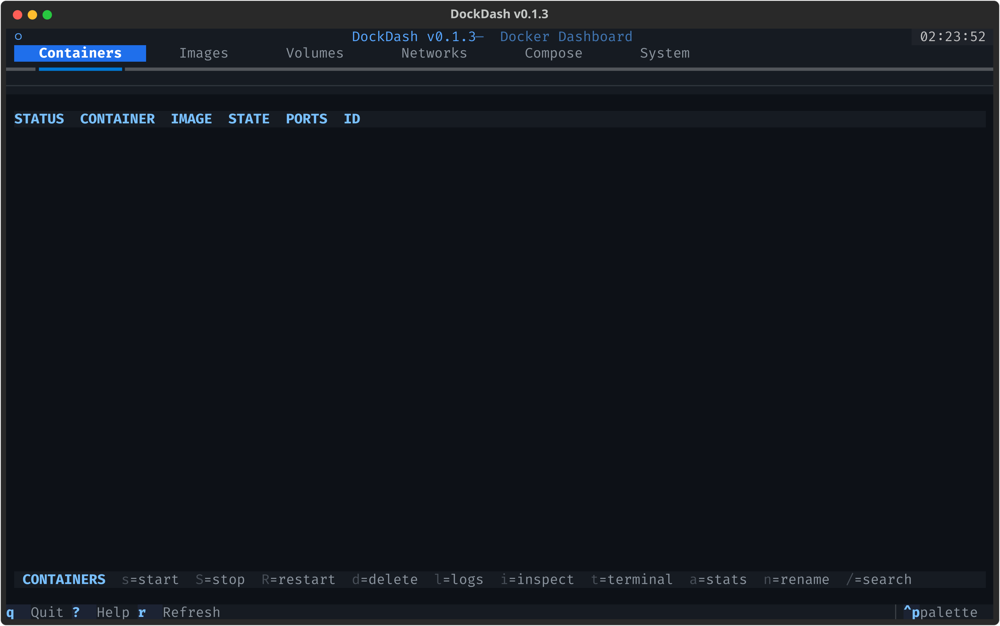
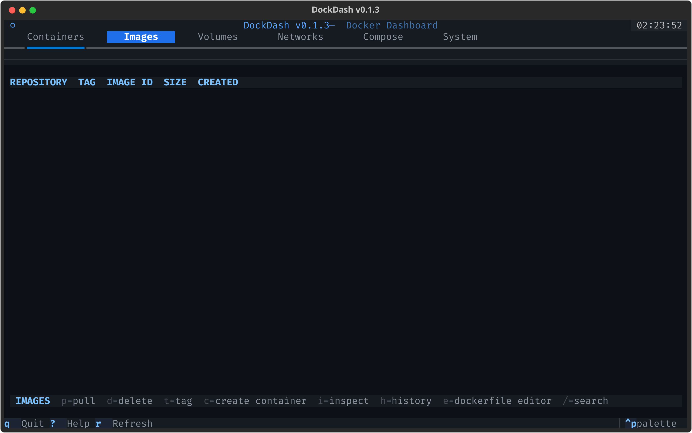
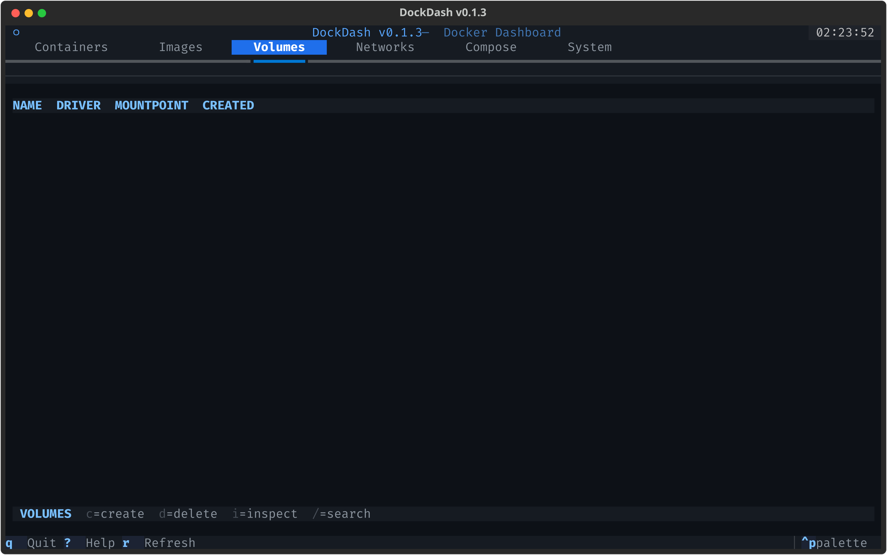
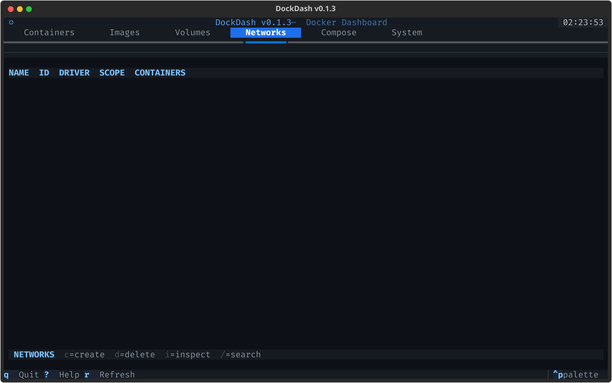
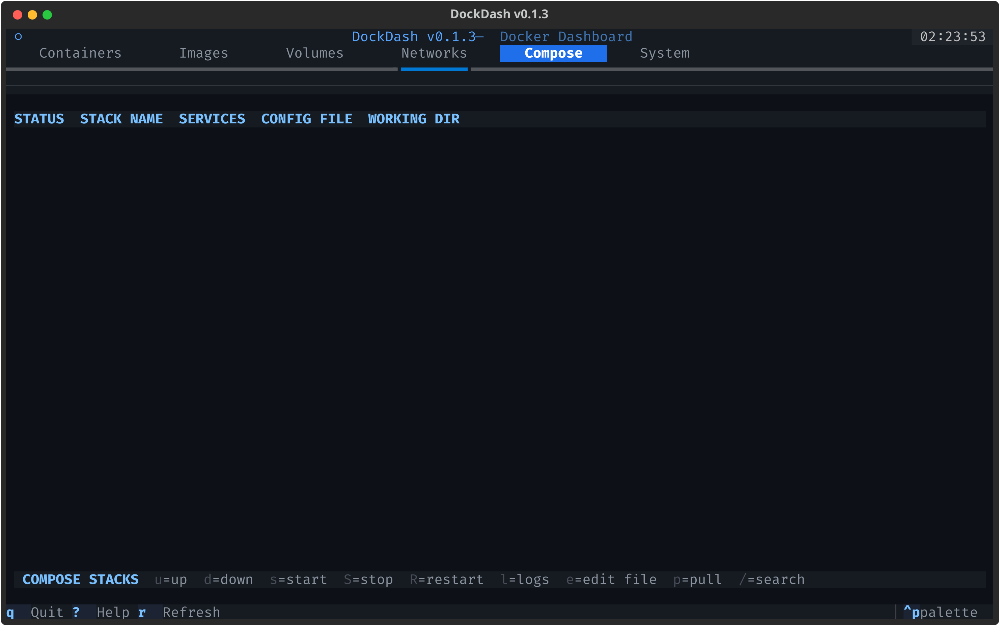
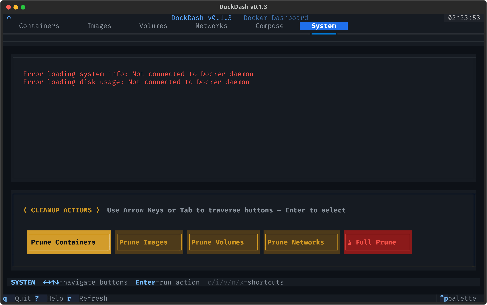
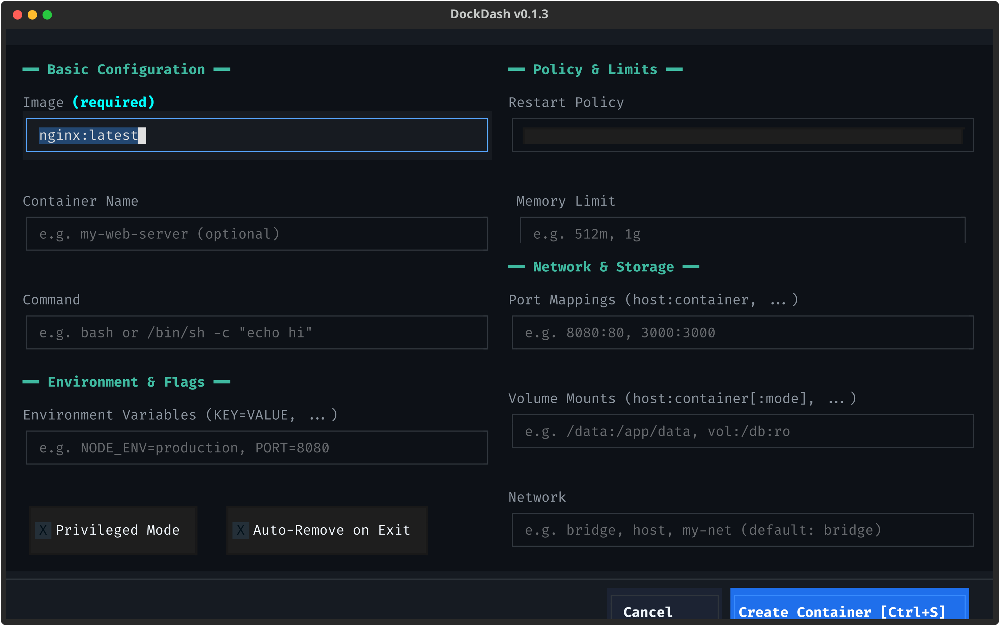
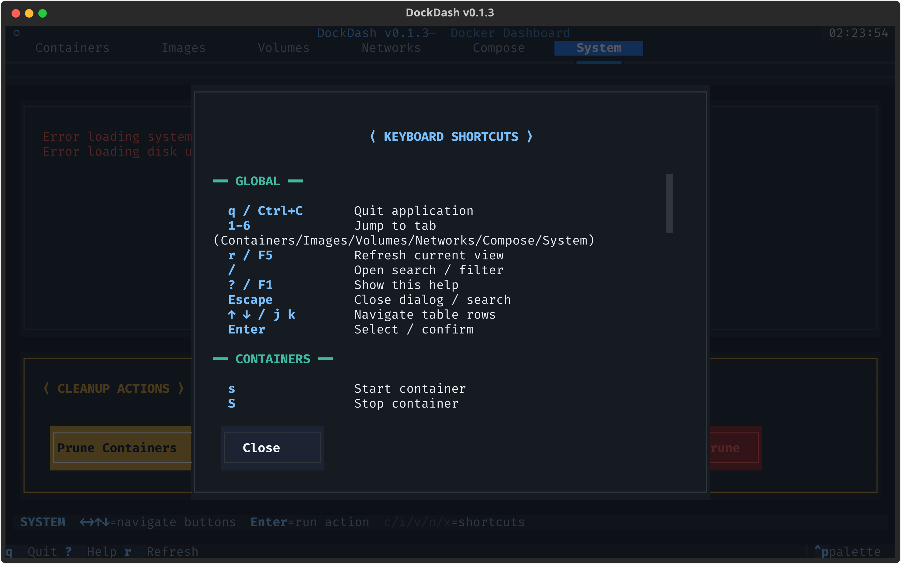

# DockDash

A powerful, keyboard-driven Docker management dashboard built for the terminal.

---

## Overview

**DockDash** provides a modern, high-contrast Terminal User Interface (TUI) for inspecting, managing, and controlling Docker Engine resources. Built using Python, Textual, and the official Docker SDK, DockDash delivers desktop-grade interactivity directly within your terminal window.

---

## Key Features

- **Containers Management**: Start, stop, restart, pause, rename, and force-remove containers.
- **Live Container Stats**: Real-time monitoring of CPU%, memory usage, network I/O, disk I/O, and PID metrics.
- **Full-Screen Log Viewer**: Fast log viewer with text scrolling, clean ANSI markup handling, and one-key log clearing.
- **Interactive Shell Access**: Attach directly to running containers (`t`) via interactive terminal execution.
- **Images Management**: Pull, delete, tag/rename, and inspect local images with layer history view.
- **Dockerfile Editor**: Built-in full-screen editor with line numbers, file editing, saving, and direct image building.
- **Container Creation Wizard**: Responsive 2-column full-screen form for configuring ports, volumes, environment variables, restart policies, and resource limits.
- **Volumes & Networks**: Inspect, create, and remove Docker volumes and networks with built-in protection for core networks.
- **Docker Compose Stacks**: Manage multi-container stacks automatically grouped by project labels or local `docker-compose.yml` files. Supports `up`, `down`, `start`, `stop`, `restart`, `pull`, combined stack logs, and full-screen compose file editing.
- **System Overview & Disk Cleanup**: Real-time Engine attributes, disk usage breakdown, and non-blocking prune tools for containers, images, volumes, networks, or full system prune.
- **Keyboard-Driven Traversal**: Smooth focus traversal across interactive controls using Arrow keys (`left`, `right`, `up`, `down`), `Tab`, and context keybindings (`1` to `6`).

---

## Interface Showcase

### Containers Management (`1`)
Inspect running and stopped containers with live status labels, search filtering, detailed attribute panels, and real-time resource stats.



---

### Image Management (`2`)
View local images, layer histories, inspect configurations, and launch the full-screen Dockerfile editor or container creation wizard.



---

### Volumes Management (`3`)
List persistent storage volumes, inspect volume driver attributes, and perform safe creation or deletion.



---

### Networks Management (`4`)
Manage Docker networks (bridge, host, overlay, custom) with built-in protection against accidental deletion of system networks.



---

### Docker Compose Stacks (`5`)
Control multi-container compose projects automatically grouped by project labels or local `docker-compose.yml` configuration files.



---

### System Overview & Cleanup (`6`)
Monitor Docker Engine attributes, memory/disk usage breakdown, and trigger single-key or arrow-traversable system prune actions.



---

### Full-Screen Container Creation Wizard
Responsive 2-column full-screen form for configuring container images, ports, volumes, environment variables, restart policies, and CPU/memory resource limits.



---

### Keyboard Shortcuts Reference Modal
Press `?` or `F1` at any time to open the full interactive keybindings reference card.



---

## Quick Start & Installation

### System Requirements
- Operating System: Linux (Ubuntu, Debian, Arch Linux, Fedora), macOS, or Windows
- Python `>= 3.10`
- Docker Engine running locally (or Docker Desktop)

---

### Installation Methods

#### Option A: Running from Source / PyPI

```bash
# Clone repository
git clone https://github.com/Ketan-Chaudhary/dockerdash.git
cd dockerdash

# Create virtual environment
python -m venv .venv
source .venv/bin/activate  # On Windows: .venv\Scripts\activate

# Install dependencies and package
pip install -e .

# Launch DockDash
dockdash
```

#### Option B: Standalone Binary (Linux / macOS / Windows)

Standalone compiled executables requiring no Python installation are available under [GitHub Releases](https://github.com/Ketan-Chaudhary/dockerdash/releases):

- **Linux (x86_64)**:
  ```bash
  tar -xzvf dockdash-linux-x86_64-v0.1.3.tar.gz
  ./dockdash
  ```
- **Windows**:
  Download `dockdash.exe` and run from PowerShell or Command Prompt:
  ```cmd
  .\dockdash.exe
  ```
- **Arch Linux**:
  Download source tarball or build via `PKGBUILD`:
  ```bash
  makepkg -si
  ```

---

## Keyboard Shortcuts Reference

### Global Controls

| Shortcut | Action |
| :--- | :--- |
| `1` | Switch to Containers tab |
| `2` | Switch to Images tab |
| `3` | Switch to Volumes tab |
| `4` | Switch to Networks tab |
| `5` | Switch to Compose Stacks tab |
| `6` | Switch to System & Cleanup tab |
| `r` / `F5` | Refresh current tab data |
| `/` | Open search / filter bar |
| `?` / `F1` | Open Keyboard Shortcuts help modal |
| `q` / `Ctrl+C` | Quit application |
| `Esc` | Close active dialog, filter bar, or modal |

---

### Containers Tab (`1`)

| Shortcut | Action |
| :--- | :--- |
| `s` | Start container |
| `S` | Stop container |
| `R` | Restart container |
| `p` | Pause / Unpause container |
| `n` | Rename container |
| `d` | Delete container (requires confirmation) |
| `l` | Open full-screen Log Viewer (`Esc`/`q` to close, `c` to clear) |
| `a` | Toggle real-time container Stats panel |
| `i` | Open full-screen JSON Inspect view |
| `t` | Attach terminal (interactive shell execution) |
| `Enter` | Toggle Container Detail side panel |

---

### Images Tab (`2`)

| Shortcut | Action |
| :--- | :--- |
| `p` | Pull new image (`repository:tag`) |
| `t` | Tag / rename image |
| `c` | Launch Container Creation Wizard for selected image |
| `e` | Open full-screen Dockerfile Editor (`Ctrl+S` to save, build button) |
| `h` | View image layer history |
| `i` | Open full-screen JSON Inspect view |
| `d` | Delete image (requires confirmation) |

---

### Volumes (`3`) & Networks (`4`) Tabs

| Shortcut | Action |
| :--- | :--- |
| `c` | Create new volume or network |
| `i` | Inspect volume or network details |
| `d` | Remove volume or network (protected for system networks) |

---

### Compose Stacks Tab (`5`)

| Shortcut | Action |
| :--- | :--- |
| `u` | Run `docker compose up -d` for selected stack |
| `d` | Run `docker compose down` for selected stack |
| `s` | Start stack containers (`docker compose start`) |
| `S` | Stop stack containers (`docker compose stop`) |
| `R` | Restart stack containers (`docker compose restart`) |
| `p` | Pull stack images (`docker compose pull`) |
| `l` | Open combined full-screen logs for stack |
| `e` | Edit `docker-compose.yml` in full-screen editor |

---

### System & Cleanup Tab (`6`)

| Shortcut | Action |
| :--- | :--- |
| `left` `right` `up` `down` | Traverse cleanup action buttons |
| `Enter` | Trigger selected prune action |
| `c` | Prune stopped containers |
| `i` | Prune dangling images |
| `v` | Prune unused volumes |
| `n` | Prune unused networks |
| `x` | Trigger Full System Prune |

---

## Project Architecture

```
dockerdash/
├── pyproject.toml               # Package configuration & dependencies
├── LICENSE                      # MIT License
├── README.md                    # Project documentation
├── docs/
│   └── screenshots/             # Interface SVG screenshots
├── tests/                       # Unit test suite (pytest)
│   ├── test_app.py
│   └── test_docker_client.py
└── dockdash/
    ├── __init__.py
    ├── app.py                   # Main Textual App & global event routing
    ├── docker_client.py         # Async Docker Engine API client wrapper
    ├── styles.tcss              # High-contrast stylesheet
    ├── screens/
    │   ├── containers.py        # Containers management screen
    │   ├── images.py            # Images management screen
    │   ├── volumes.py           # Volumes management screen
    │   ├── networks.py          # Networks management screen
    │   ├── compose.py           # Docker Compose stacks screen
    │   └── system.py            # Engine status & cleanup screen
    ├── widgets/
    │   ├── container_detail.py  # Container attributes panel
    │   ├── log_viewer.py        # Full-screen log viewer screen
    │   ├── stats_display.py     # Real-time container stats widget
    │   ├── pull_progress.py     # Image pull progress bar
    │   └── search_bar.py        # Search and filter bar
    └── modals/
        ├── container_create.py  # Full-screen container creation wizard
        ├── dockerfile_editor.py # Full-screen Dockerfile editor
        ├── confirm_dialog.py    # Confirmation modal
        ├── input_dialog.py      # Text input modal
        ├── inspect_dialog.py    # Full-screen JSON inspect dialog
        └── help_dialog.py       # Keybindings reference modal
```

---

## Author & License

Developed and maintained by **Ketan Chaudhary**.

Distributed under the **MIT License**. See [LICENSE](LICENSE) for full details.

Copyright (c) 2026 **Ketan Chaudhary**
